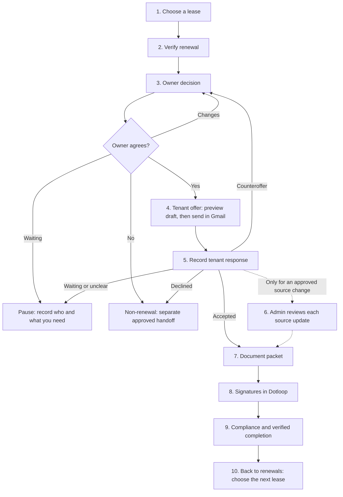

# Renew a lease, one step at a time

Use the same guide for every lease. No particular month, property, rent or tenant is required.
**Bold labels** match the app. Step numbers belong to this guide. The app has six phase links;
it does not have a universal Next button.

**Readiness checked: 9 September 2026.** Use this for a reading walkthrough today. The newer build
is awaiting release checks. The owner-message evidence handoff and document completion still have
gaps. A complete live renewal has not passed an end-to-end demonstration. The facilitator must
confirm the available version before anyone records a change.
See the [meeting readout](wednesday-delivery-readout-2026-09-09.md).

## The whole process

**Today's stopping points:** an owner response may lack its required sent-message evidence;
packet creation and verified completion are not ready. Explain those stages without marking them
complete. When a verified answer arrives, return to the paused step. A separate non-renewal handoff
is not a completed renewal.

**Who does what:** the operator needs Editor access in Renewals. An Approver or Admin handles source
conflicts; High corrections require Admin. Admin approves pricing suggestions and source changes.
A person reviews and sends every email in Gmail.

## Find the lease and check its facts

### 1. Choose any lease

**Go:** open [Renewals](https://pmi-kc-app-kq6wuvpiva-uc.a.run.app/lease-renewal).

If prompted, click **Sign in with Google** and use your approved pmikcmetro.com account.
If access is refused, stop and ask the facilitator to check access with an Admin.

**Do:** click **Filter renewal date**. Choose the required **Month**, then **Apply month**.
Check the row's tenant and ending date. Click the **property address** in that row.

**Check:** the workspace shows the intended property, tenant and lease. Read **Do this next** or
**Waiting**, and the phase links. Opening another phase does not complete it.

**If stuck:** use **Clear filters** for an empty list. Stop and report an unavailable source.
Do not select a similarly named person as a substitute.

**Next:** click **Verify renewal**.

### 2. Verify renewal

**Do:** compare owner, tenant, dates and contractual base rent. Keep listed rent and extra charges
separate. Use **Open this lease in RentVine** and **Open the operating renewal Sheet** when shown.
They open another tab; return to the app tab afterward.

If the term needs review, choose **Lease term**, enter the evidenced **Reason**, and click
**Record lease term**. For month-to-month, also enter the verified start date requested by the form.
For conflicts, an Approver or Admin clicks **Resolve**, reviews the decision, then
**Confirm resolution**. This records a decision; it does not change either source.

**Check:** facts agree or the exact conflict has a recorded resolution. Unknown rent stays unknown.
Month-to-month work follows its annual review; do not invent a fixed end date.

**If stuck:** pause for a missing source link, uncertain identity, stale data or unresolved conflict.
Return to the desk and refresh when the app says the data is too old.

**Next:** click **Owner decision**.

## Get and record the owner's decision

### 3. Owner decision

**Do:** if the owner has approved the offer, choose the matching **Owner decision**, enter
**Offered rent (monthly)** and only the applicable approved charges. Click **Record owner decision**,
or **Update owner decision** to correct an existing decision. Read the saved terms back.

If you still need to ask the owner, **Preview the owner email** shows wording only. To prepare an
eligible Gmail draft, click **Tenant decision**, find **Renewal-notice draft**, select **Owner notice**,
and follow step 4. Return here when the actual answer arrives. Do not record approval to unlock an offer.

**When shown:** choose **Owner response**, select **Evidence source**, enter its
**Exact evidence reference**, then click **Record owner response**. Use the actual receipt or record
identifier. Ask the facilitator for help finding it; do not enter a message body.

**Check:** follow the owner's actual answer:

| Owner answer            | What to do next                                                      |
| ----------------------- | -------------------------------------------------------------------- |
| Approved the terms      | Continue with current approved terms to step 4.                      |
| Asked for changes       | Revise the terms and get a new approval; re-preview affected drafts. |
| No response yet         | Keep this lease waiting for the owner.                               |
| Declined / not renewing | Arrange the separate approved non-renewal handoff.                   |

**If stuck:** the response form requires recorded evidence of the sent owner message. The current
app has no verified complete click path that supplies this for a new lease. Linking a Gmail thread
does not fill that gap. Stop and ask the facilitator to log it; do not bypass it.

**Next:** with verified approval and current terms, click **Tenant decision**.

## Prepare the offer and review it in Gmail

### 4. Tenant offer, or the owner's request

**Go:** in **Tenant decision**, find **Renewal-notice draft**. Select **Tenant offer** for the tenant,
or **Owner notice** when doing the owner-request part of step 3.

**Do:** check the selected channel and all applicable inputs. For a tenant offer, check
**Owner decision** and **Offered rent (monthly)** against the approved terms. Click **Preview draft**.

**Check before creating:** correct recipient, subject, wording, rent, dates, term and any attachment.
An edited value needs a fresh preview. **Preview review-only copy** means the wording still needs
approval; stop there. A market estimate does not approve rent. Comp requests use the allowance and
are optional; do not request one merely for the demonstration.

**Do:** click **Create Gmail draft** only for the exact reviewed, eligible draft. Wait for its result.
Open the signed-in managed mailbox in Gmail, locate the returned draft and inspect it again.
The person responsible for the communication sends it in Gmail when ready.

**Check:** a created draft is unsent. Sending it proves neither a reply nor acceptance.

**If stuck:** for an uncertain creation result, use **Check exact attempt**. Wait for that result
before creating another. For a missing recipient, source fact or approved copy, record the named item.

**Next:** owner request: return to step 3. Tenant offer: continue to step 5 when real evidence exists.

## Record what the tenant actually answered

### 5. Tenant response and waiting

**Go:** click **Tenant decision**. The outcome form appears only after a current owner decision
and current tenant-offer draft are recorded.

**Do:** choose **Tenant outcome**. Select **Evidence source**, enter the **Exact evidence reference**
from the actual message or verified record, then click **Record tenant outcome**.

**Check:** the displayed current outcome is correct. Follow the matching route:

| Tenant answer              | What to do next                                                                   |
| -------------------------- | --------------------------------------------------------------------------------- |
| Accepted                   | Continue to step 7. Use step 6 only for an applicable approved source change.     |
| Waiting for response       | Pause. Resume when the actual reply arrives.                                      |
| Counter / change requested | Return to step 3 for the owner's decision on revised terms. Re-preview the offer. |
| Declined / non-renewing    | Arrange the separate approved non-renewal handoff.                                |
| Needs verification         | Obtain the exact missing fact; do not record acceptance.                          |

**Optional contact check:** open **Link or refresh exact Gmail evidence**. Choose
**Communication party**, enter **Exact Gmail thread ID** and **Reason for linking**, then
**Link exact thread**. For an existing link, use **Refresh this linked thread**. This checks contact
evidence; it does not send or establish owner approval. Ask the facilitator for an exact ID if needed.

**If stuck:** a draft, linked thread or outgoing message is not acceptance. Keep the lease waiting
until the actual answer is verified. If the outcome form is absent, check its prerequisites.

## Optional: have an Admin update the source records

### 6. Only when this lease needs an approved source change

**Go:** return to **Verify renewal**. These corrected controls require the newer accepted release.
Do this when the approved transaction requires it. Each lease need not use every operation.

**RentVine:** open **Prepare a RentVine update proposal**. Fill only the applicable lease-date or
recurring-charge section with the approved change, and its **Evidence reference**.
For dates, use **New end date (YYYY-MM-DD)** or **New increase eligibility date (YYYY-MM-DD)**.
For an existing charge, verify its **Charge id** first. Ask the Admin if the exact target is unclear.
Click **Save proposal from fresh RentVine state**. In **Review RentVine updates**,
the Admin clicks **Review and confirm…**, checks the exact target and all before/after values,
then **Confirm this exact effect once**.

**Check:** the receipt and freshly read source values show that exact result before the next
operation. An uncertain result goes to **Reconcile from provider state**; do not submit again.
Any supported correction needs its own reviewed confirmation.

**Operating Sheet:** if the app proves this lease has no exact row, use
**Prepare exact missing-row append**. In **Review Sheet updates**, the Admin clicks
**Review and confirm…**, checks the destination and every populated cell, then
**Confirm this exact effect once**. Read the result back. If a row exists, skip append.
The corrected app cannot update, delete or restore a fixed row. Ask the Admin to arrange any manual
correction at the verified Sheet destination.

**If stuck:** missing permission, ambiguous target, stale preview or uncertain result means stop
this effect. The main app's older Sheet controls are not a workaround.

**Next:** return to the current phase. For an accepted offer, click **Document packet**.

## Documents, signatures and the finish line

### 7. Document packet

**Go:** click **Document packet**. Read **Document packet truth** and its missing items.

**Do when enabled for real work:** **Evaluate packet**, or **Evaluate current truth**, prepares an
app-owned snapshot. It does not create Dotloop documents. In a reading-only rehearsal, just read the
existing state; evaluation also records app state.

**Check:** required forms need approved content, correct facts and verified participants.
The Dotloop connection, approved mappings and complete packet action path are unfinished.
**Stop here for packet creation.** There is no complete preview-to-create click path to teach yet.

**Next for explanation:** click **Signatures**. This does not mean step 7 passed.

### 8. Signatures

**Do when a verified packet exists:** use its **Open loop** link, which includes the actual loop ID,
to open Dotloop. The responsible person handles signing there and verifies the actual signed files
and required signers. Return to the app and read **Signatures**.

**Check:** a document name or count proves neither contents nor signatures. With today's packet
block, a repeatable signature-to-app completion handoff is unavailable.

**Next for explanation:** click **Compliance**.

### 9. Compliance and completion

**Do:** read **Compliance close**. Completion needs the correct signed packet and all applicable
animal, deposit, insurance/charge, inspection, term/date and exception evidence.

**Check:** this workspace has **no Mark renewal complete button**. An old local completion marker
cannot prove document execution. The final evidence handoff needs implementation and proof.
Record the actual unfinished step; do not call the renewal complete.

## If you get stuck, and when you return

| What you see                           | Do this                                                                                                  |
| -------------------------------------- | -------------------------------------------------------------------------------------------------------- |
| Blank, slow or unavailable page        | Record page and time. Try one normal reload for a read-only page. If it fails again, stop and report it. |
| Data too old to act on                 | Return to the desk, refresh, reopen the same lease and recheck facts.                                    |
| Missing or disabled control            | Read its reason. Check phase, evidence and access with the facilitator.                                  |
| Wrong or missing source value          | Pause this step. Ask the source owner for the exact correct record.                                      |
| Uncertain save, draft or source change | Use the exact attempt/reconciliation control when supplied. Do not repeat the change.                    |
| Someone has not replied or signed      | Keep it waiting on that person. A sent request is not their answer.                                      |

**Use this message:** "We stopped at [step]. We expected [result]. The app showed [message].
We need [item] from [person] by [date]. We will resume at [step] after checking [evidence]."
Fill it privately; do not put customer values, message bodies or screenshots in shared repository notes.

### 10. Move to the next lease, then resume safely

1. Record the lease link, last verified step, blocker, responsible person and agreed follow-up date
   in the approved private work record. A blank owner/date means follow-up is still unassigned.
2. Click **← Back to renewals**, then open the next lease's address. Start again at step 1.
3. On returning, reread identity, freshness and saved state. Resume at the paused step only when
   its missing evidence is verified. Do not repeat a successful effect.

**Ready for routine use means:** a new operator follows this guide without coaching, sees the
expected results and completes the applicable path on real leases. That outcome is not yet verified.
Record actual completion and failures; do not infer throughput from a successful read or test run.

Use the [blocker sheet](wednesday-decisions-and-inputs-2026-09-09.md) to assign work.
Maintainer sources are in the [control review](../evidence/renewal-training-control-review-2026-09-09.md).
