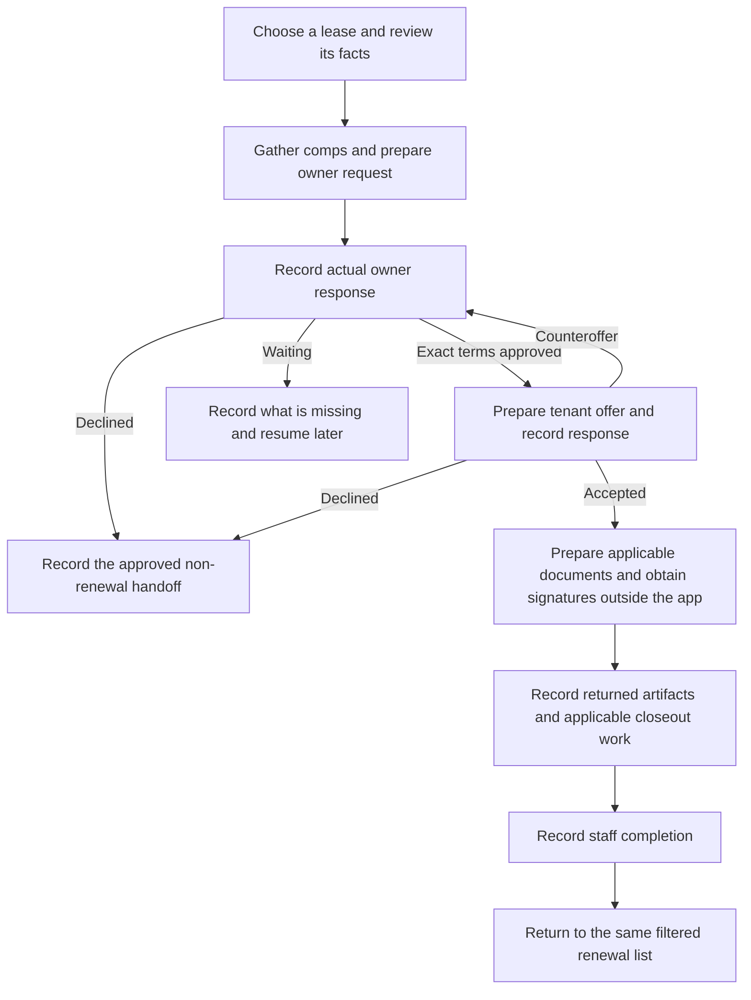

# Renew a lease, one dashboard

Updated for S113 on 10 September 2026. This is the same staff/Wednesday packet location.
The verified S113 workflow is deployed. Read
[current status](../status.md) for the exact serving result before the session. Read-only rehearsal
cannot save changes. Use the [operator guide](renewal-operator-guide.md) for exact controls and
[printable guide](renewal-training-guide.pdf) for the session.

## The whole process

Provider writes and receipts remain separate from this manual record. A person sends every message.

## Walk through any lease

1. Open **Renewals**, filter the list, and choose the exact lease. Check property, tenant, dates and
   base rent. Use **Lease details** to compare sources; separate charges and unit listed rent are
   not base rent. **Do this next** focuses the relevant control without completing anything.
2. If a fact is wrong, use **Correct a lease fact**. Choose a value/source and the supported
   destination. The approving role reviews it. Admin confirms each exact Sheet or RentVine effect
   independently and reads the result. Recover an uncertain existing attempt before trying again.
3. Use **Comps** and **Owner message preparation** before requesting owner approval. Review the
   comp evidence and message, then copy it or preview an eligible unsent Gmail draft. Send it
   yourself in the appropriate channel and record that actual activity.
4. Record **Owner response** with the exact approved rent and dates. Prepare the current-cycle
   tenant message; verify separate charges, applicability, links and signature. Record the actual
   tenant response. A counteroffer returns to owner review; a decline takes the non-renewal handoff.
5. Use **Documents and completion** for actual documents, signatures and applicable follow-ups.
   Record outside work with its source/channel. Not applicable needs an approved rule and reason;
   unknown stays unfinished. Pending Sheet status updates retain the recorded values for review.
6. When the applicable checklist is satisfied, **Record staff completion**. Close and reopen the
   lease to inspect the saved cycle and audit. **← Back to renewals** preserves the filtered list.
   Staff completion is distinct from a provider receipt or verified signature completion.

## When inputs are missing

The labeled insurance flyer, renewal information form and legal-form location boxes may remain
blank pending team input. Admin can save verified, applicable links later. Blank or unverified
values never become customer links or legal content. Only the exact dependent output waits.

The document handoff names missing approved forms/mappings, Dotloop connection/selection and exact
activation gates. S106 and S34 own that continuation. Current Dotloop keys remain closed. With real
inputs and activation, review exact files and mapped facts, confirm each supported action, and open
the verified loop in Dotloop for human signature work. The preview does not fill the file bytes.
A loop status or uploaded file name does not prove signatures. Record actual returned signed
artifacts; manual S113 work proceeds independently.

## Facilitator checks

Ask the operator to find a source, propose a correction, distinguish two source outcomes, recover
an uncertain attempt, prepare/copy a message, and record actual outside work. Exercise a fresh
renewal and one already underway, plus a counteroffer and missing information. Never invent a
customer effect to demonstrate the app. Record observed results against H1-H8 in the
[S113 checklist](../feature-suites/renewal-workflow-consolidation.md#h1--understand-one-lease-and-inspect-its-sources).
